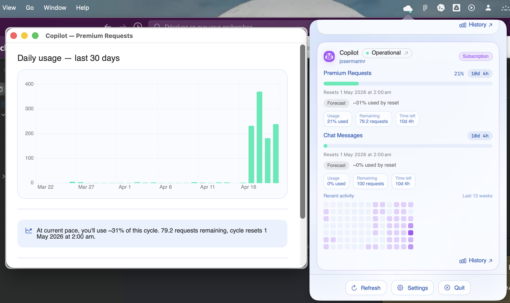
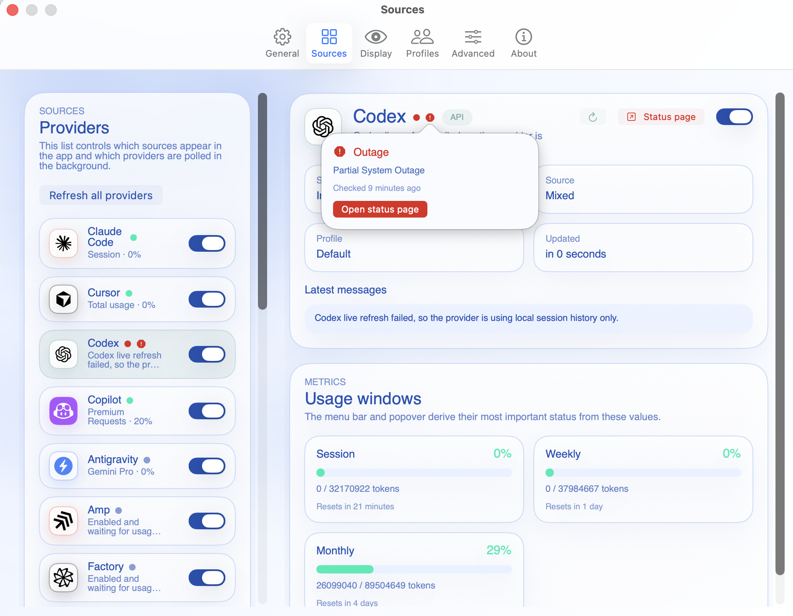

# Cirrondly Desk Community

[English](README.md) | [Español](README.es.md) | Français

Une application native macOS de barre de menus qui suit localement, en privé et
gratuitement l'utilisation de vos outils de programmation IA sur plusieurs
fournisseurs.

<p align="center">
	
</p>

## Fonctionnalités

- **10+ fournisseurs pris en charge** : suivez Claude Code, Cursor, Codex,
	Copilot, Kiro, Windsurf, JetBrains AI, Gemini CLI, Continue, Aider, Amp,
	Kimi, MiniMax, Perplexity, Antigravity, OpenCode Go, Synthetic, Z.AI et plus
	encore.
- **État du service en un coup d'oeil** : consultez la santé du service de
	chaque fournisseur directement dans le popover et dans les réglages Sources.
- **Historique et chronologie d'utilisation** : suivez l'activité par session,
	par semaine et par mois avec des barres de progression et une heatmap d'usage
	sur 90 jours.
- **Tokens restants et temps avant réinitialisation** : surveillez l'usage, les
	tokens/requêtes/crédits restants et le compte à rebours avant la prochaine
	période de réinitialisation.
- **Notifications d'alerte de quota** : recevez des alertes locales macOS quand
	un fournisseur dépasse les seuils de quota configurés.
- **Libellés d'abonnement et de type de compte** : chaque fournisseur est
	identifié comme Subscription, API, Usage Based ou Free.
- **Résumé unifié dans la barre de menus** : gardez le coût du jour, le burn
	rate et l'usage actif visibles sans ouvrir de tableau de bord.
- **Export statusline** : écrit `~/.cirrondly/usage.json` pour Claude Code
	statusLine, les prompts shell, tmux et d'autres workflows locaux.
- **Données 100% locales** : aucun compte, aucune télémétrie, aucun cloud.
	Toutes les données d'usage restent sur votre Mac.

## Installation

1. Téléchargez le dernier fichier `.dmg` depuis
   [Releases](https://github.com/cirrondly/cirrondly-desk-community/releases)
2. Ouvrez le `.dmg` puis faites glisser `Cirrondly Desk Community.app` vers
   `Applications`.
3. **Premier lancement uniquement** : Gatekeeper peut bloquer l'application.
	Faites un clic droit sur l'application dans `Applications`, choisissez
	`Open`, puis choisissez à nouveau `Open` dans la boîte de dialogue.

	Si cela ne fonctionne pas, ouvrez Terminal et exécutez :

```bash
xattr -cr /Applications/Cirrondly\ Desk\ Community.app
```

4. Ouvrez l'application. C'est tout.

Nous travaillons sur la signature Apple pour une prochaine version. En
attendant, les GitHub Releases ne sont ni signées ni notarized, et Gatekeeper
peut donc afficher un avertissement lors du premier lancement.

## Prérequis

- macOS 14 (Sonoma) ou version ultérieure
- Aucun compte Claude, Cursor ou Copilot n'est requis. L'application lit les
	fichiers locaux déjà présents si ces outils sont installés.

## Captures d'écran

<p align="center">
	
	
</p>

<p align="center">
	
	
</p>

<p align="center">
	
</p>

<p align="center">
	
	
</p>

## Compiler depuis les sources

```bash
git clone https://github.com/cirrondly/cirrondly-desk-community.git
cd cirrondly-desk-community
open CirrondlyDesk.xcodeproj
```

Nécessite Xcode 16 ou version ultérieure.

## Contribution

Voir [CONTRIBUTING.md](CONTRIBUTING.md).

## Remerciements

Ce projet s'inspire d'excellents travaux open source :

- **[openusage](https://github.com/robinebers/openusage)** pour son architecture
	de plugins dédiée au suivi d'usage multi-fournisseurs.
- **[Claude-Code-Usage-Monitor](https://github.com/Maciek-roboblog/Claude-Code-Usage-Monitor)** pour sa logique de burn rate et de prédiction.
- **[ClaudeMeter](https://github.com/eddmann/ClaudeMeter)** pour son indicateur
	de barre de menus coloré et sa structure de réglages.
- **[Claude-Usage-Tracker](https://github.com/hamed-elfayome/Claude-Usage-Tracker)** pour son approche multi-profils et ses patterns natifs macOS.
- **[ccusage](https://github.com/ryoppippi/ccusage)** comme référence pour le
	parsing JSONL de Claude Code.

Ces projets sont indépendants et soumis à leurs propres licences. Nous avons
réimplémenté une fonctionnalité similaire en Swift depuis zéro ; aucun code n'a
été copié.

## Avertissement

Cet outil n'est pas officiel et n'est ni affilié, ni approuvé, ni pris en
charge par Anthropic, OpenAI, GitHub, Amazon, Google, JetBrains, Cursor ou tout
autre fournisseur d'outils de programmation IA.

Les données sont lues depuis des fichiers locaux sur votre Mac. Aucun compte
n'est accédé. Aucun appel n'est effectué vers les API des fournisseurs IA sauf
si vous les configurez explicitement dans Sources.

## Licence

Licence Apache 2.0. Voir [LICENSE](LICENSE).

"Cirrondly" et le logo nuage de Cirrondly sont des marques déposées de
Cirrondly SAS ; voir [TRADEMARKS.md](TRADEMARKS.md).