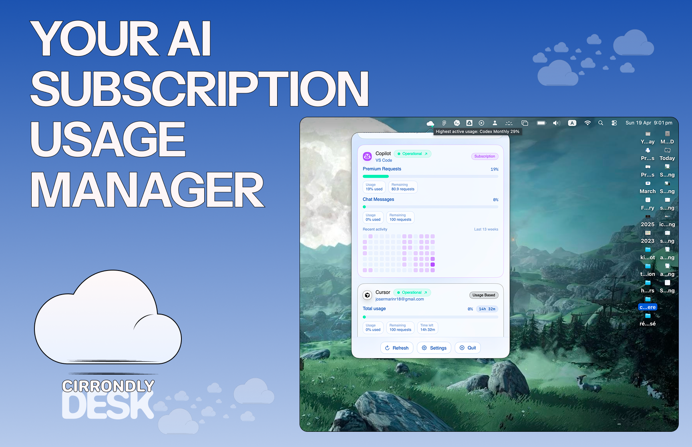

# Cirrondly Desk Community

English | [Español](README.es.md) | [Français](README.fr.md)

A native macOS menu bar app that tracks your AI coding tool usage across multiple
providers locally, privately, for free.

<p align="center">
	
</p>

## Features

- **10+ providers supported**: track Claude Code, Cursor, Codex, Copilot,
	Kiro, Windsurf, JetBrains AI, Gemini CLI, Continue, Aider, Amp, Kimi,
	MiniMax, Perplexity, Antigravity, OpenCode Go, Synthetic, Z.AI, and more.
- **Service status at a glance**: see provider service health directly in the
	popover and Sources settings.
- **Usage timeline and history**: follow session, weekly, and monthly activity
	with progress bars plus a 90-day usage heatmap.
- **Remaining tokens and time to reset**: monitor usage, remaining
	tokens/requests/credits, and the countdown to the next reset window.
- **Quota alert notifications**: receive local macOS alerts when a provider
	crosses your configured quota thresholds.
- **Subscription and account type labels**: each provider is tagged as
	Subscription, API, Usage Based, or Free.
- **Unified menu bar summary**: keep today's cost, burn rate, and active usage
	visible without opening a dashboard.
- **Statusline export**: writes `~/.cirrondly/usage.json` for Claude Code
	statusLine, shell prompts, tmux, and other local workflows.
- **100% local data**: no account, no telemetry, no cloud. All usage data stays
	on your Mac.

## Installation

1. Download the latest `.dmg` from [Releases](https://github.com/cirrondly/cirrondly-desk-community/releases)
2. Open the `.dmg` and drag `Cirrondly Desk Community.app` to `Applications`.
3. **First launch only**: Gatekeeper may block the app. Right-click the app in
	`Applications`, choose `Open`, then choose `Open` again in the dialog.

	If that does not work, open Terminal and run:

```bash
xattr -cr /Applications/Cirrondly\ Desk\ Community.app
```

4. Open the app. That's it.

We're working on Apple signing for a future release. Until then, GitHub
Releases are unsigned and not notarized, so Gatekeeper may show a warning on
first launch.

## Requirements

- macOS 14 (Sonoma) or later
- No Claude, Cursor, or Copilot account required. The app reads from local
	files you already have if those tools are installed.

## Screenshots

<p align="center">
	
	
</p>

<p align="center">
	
	
</p>

<p align="center">
	
</p>

## Building from source

```bash
git clone https://github.com/cirrondly/cirrondly-desk-community.git
cd cirrondly-desk-community
open CirrondlyDesk.xcodeproj
```

Requires Xcode 16 or later.

## Contributing

See [CONTRIBUTING.md](CONTRIBUTING.md).

## Acknowledgments

This project draws inspiration from excellent open-source work:

- **[openusage](https://github.com/robinebers/openusage)** plugin architecture
	for multi-provider usage tracking.
- **[Claude-Code-Usage-Monitor](https://github.com/Maciek-roboblog/Claude-Code-Usage-Monitor)** burn rate and prediction logic.
- **[ClaudeMeter](https://github.com/eddmann/ClaudeMeter)** color-coded
	menu bar indicator and settings structure.
- **[Claude-Usage-Tracker](https://github.com/hamed-elfayome/Claude-Usage-Tracker)** multi-profile approach and native macOS patterns.
- **[ccusage](https://github.com/ryoppippi/ccusage)** Claude Code JSONL
	parsing reference.

These projects are independent and under their own licenses. We re-implemented
similar functionality in Swift from scratch; no code was copied.

## Disclaimer

This is an unofficial tool and is not affiliated with, endorsed by, or supported
by Anthropic, OpenAI, GitHub, Amazon, Google, JetBrains, Cursor, or any other
AI coding tool vendor.

Data is read from local files on your own Mac. No accounts are accessed.
No API calls are made to AI vendor APIs unless you explicitly configure them
in Sources settings.

## License

Apache License 2.0. See [LICENSE](LICENSE).

"Cirrondly" and the Cirrondly cloud logo are trademarks of Cirrondly SAS
see [TRADEMARKS.md](TRADEMARKS.md).
